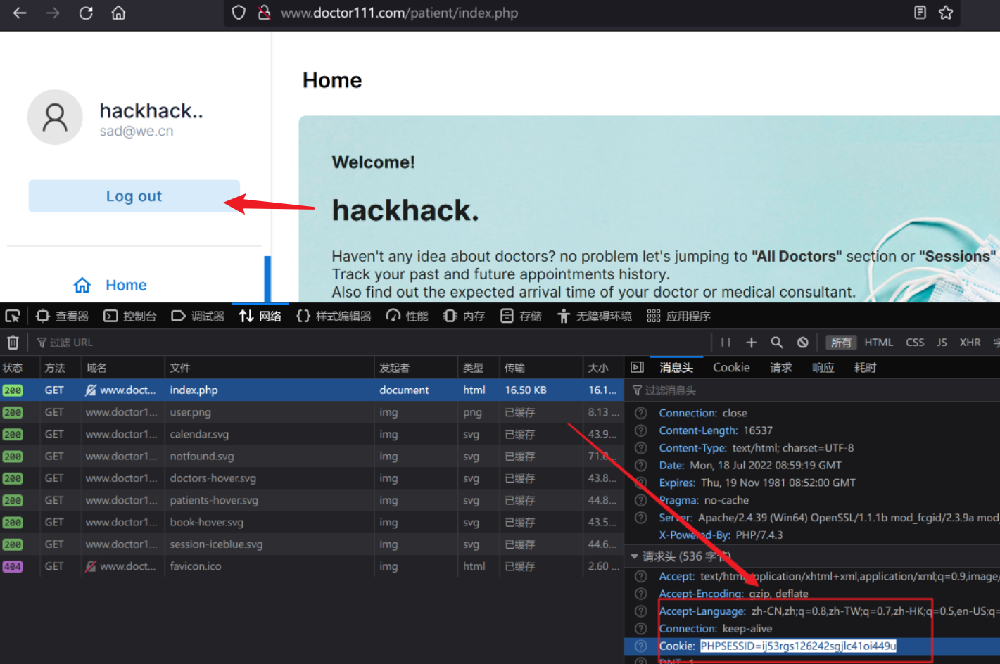
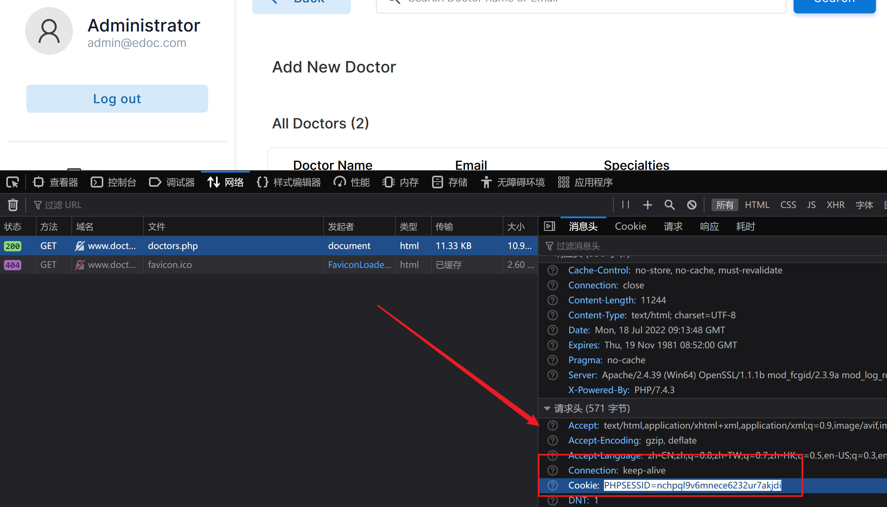
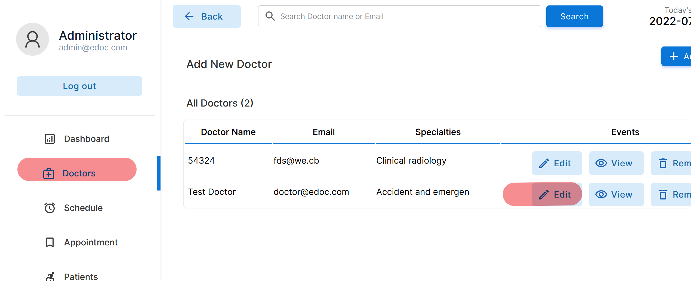
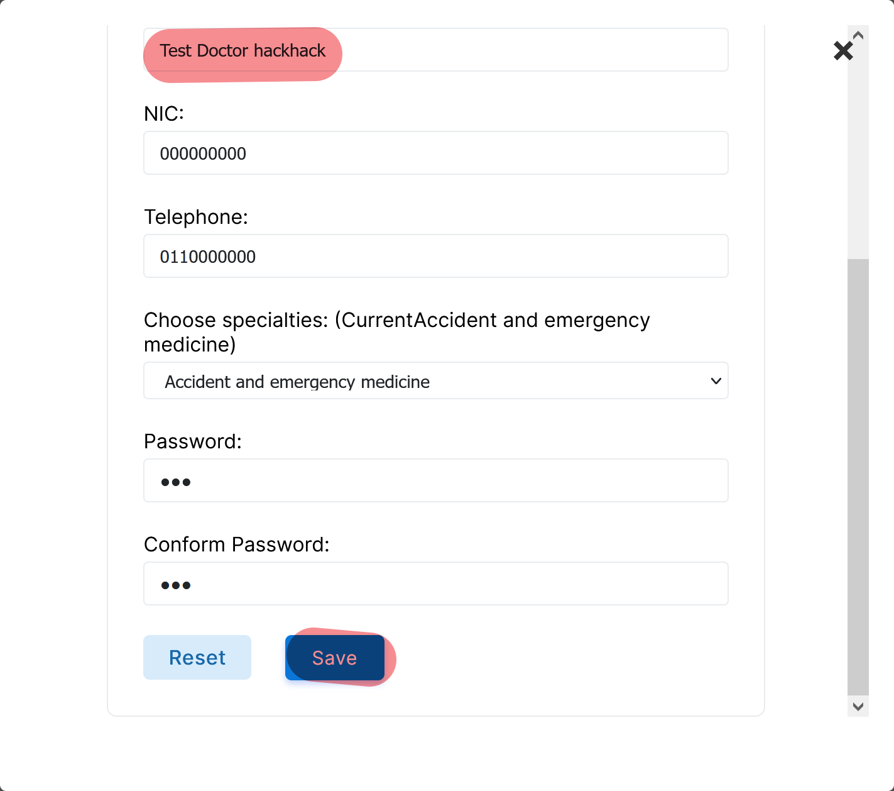
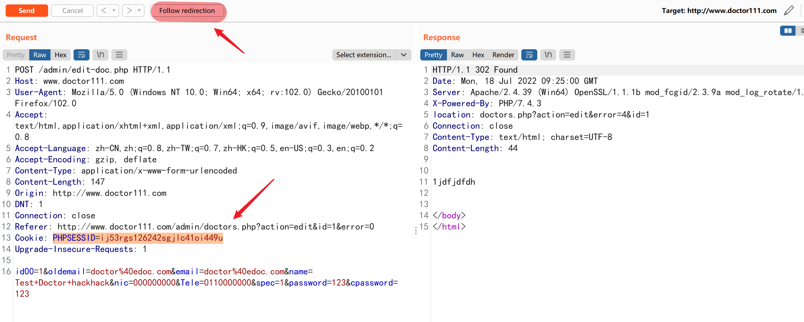
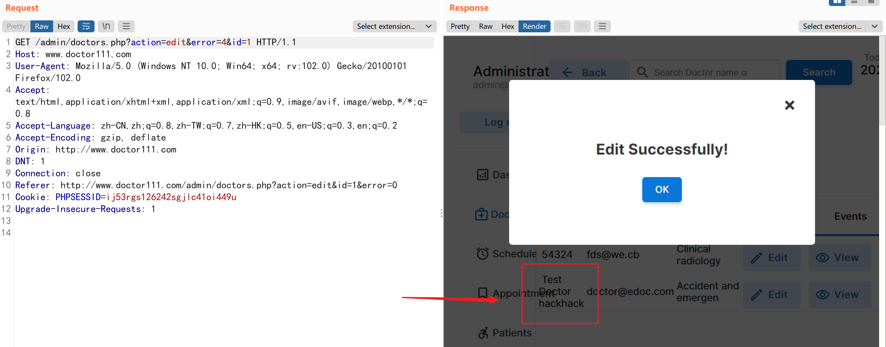
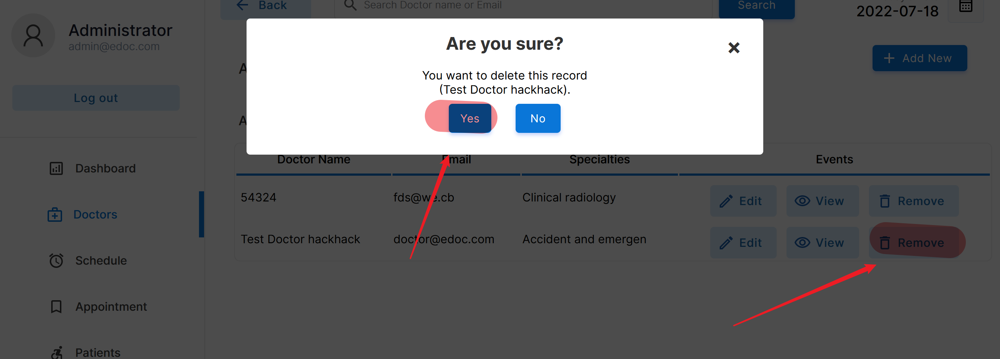
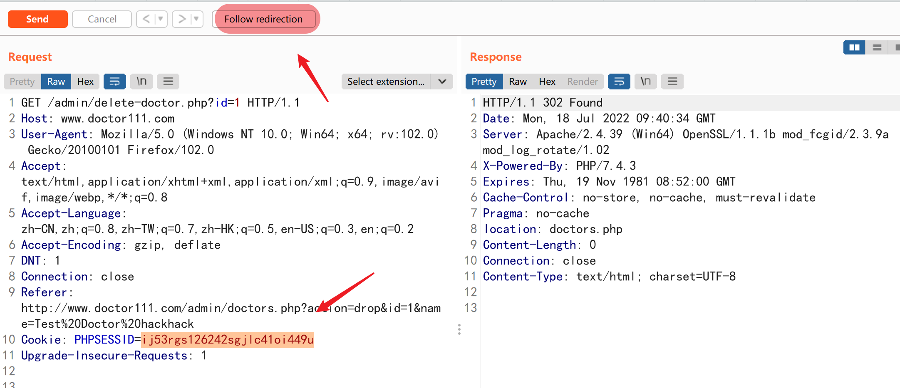
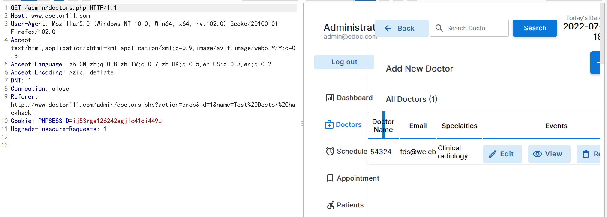

# Edoc-doctor-appointment-system v1.0.1  was discovered to broken access control vulnerability. Allow remote attackers to edit , read ,delete Administrator data 

vendor:https://github.com/HashenUdara/edoc-doctor-appointment-system

Vulnerability Position：http://ip/admin/*


Log in to the http://ip/login.php as common user , and then copy common user's cookie.

```
PHPSESSID=ij53rgs126242sgjlc41oi449u
```




Log out common user , and log in to the http://ip/login.php as administrator (email : admin@edoc.com , password : 123).


At this time , administrator's cookie is `PHPSESSID=nchpql9v6mnece6232ur7akjdi`.




## Try to edit some data

Click Edit button , and change Doctor name to `Test Doctor hackhack`.




Use burpsuite to capture request packet , and then click the Save button.




Use common user's cookie instead administrator's cookie , requestion will redirect to someway.

Then click Follow redirection button.



You will see success page , and `Test Doctor` change to `Test Doctor hackhack`.




## Try to delete some data

Similar to edit data , you just click `Remove` button , then use burp suite to capture request packet , and then click the  `Yes` button.




Use common user's cookie instead administrator's cookie , requestion will redirect to someway.

Then click Follow redirection button.




You will see  `Test Doctor hackhack` information has gone.

