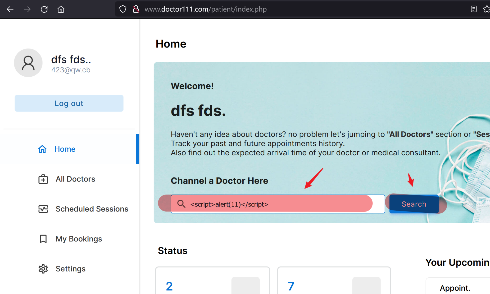
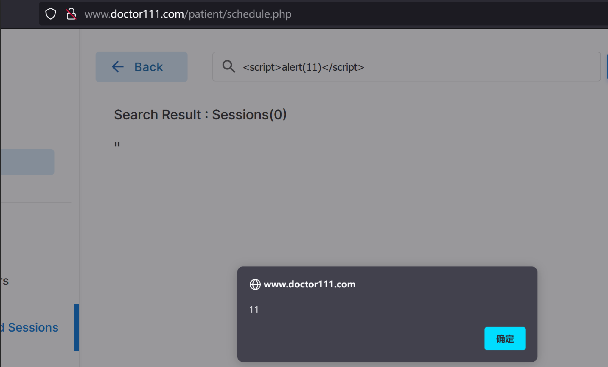

# Reflected Cross Site Scripting (XSS) vulnerability exists in edoc-doctor-appointment-system v1.0.1 . A successful exploit could allow the attacker to execute arbitrary script code which could lead to stealing or modifying of authentication information of the user, such as data relating to his or her current session.

vendor:https://github.com/HashenUdara/edoc-doctor-appointment-system

Vulnerability Position：http://ip/patient/index.php 

Log in to the http://ip/login.php

Visit http://ip/patient/index.php ， Will access the page of the module

Fill it with``，then click search button.

You will see the pop -up window.

